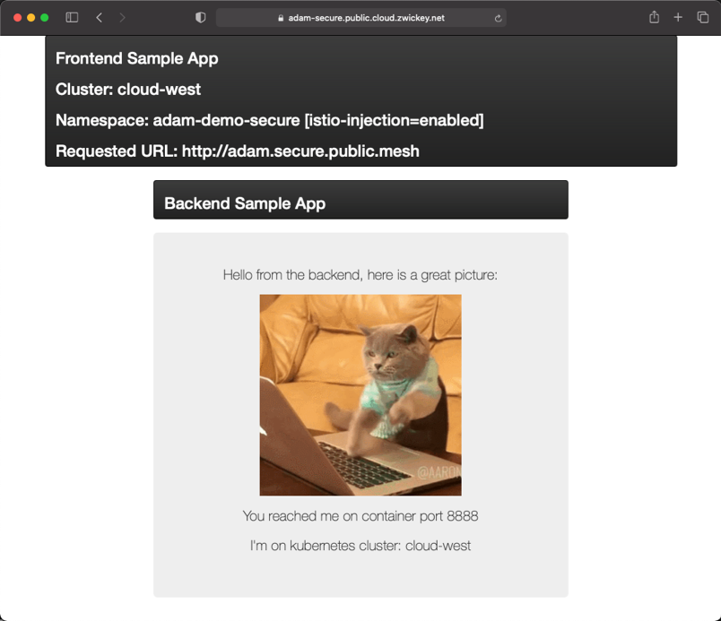

# networking-demo
This is a sample app that can be used to test and deomnstrate service mesh neworking.  It is composed of a frontend app, which exposes a simple UI, and a backend, which will return a simple message plus image to the UI.



This can be used to easliy demonstrate various use cases such as multi-cluster or multi-cloud service discovery and routing, service mesh Authentication and Authroization, or Legacy VM networking when introduced to the mesh.

## Build and deployment
The easiest way to build the application and produce a container image is using [Cloud Native Buildpacks](https://buildpacks.io/) + the [Pack CLI](https://buildpacks.io/docs/tools/pack/)

```bash
cd frontend/
pack build frontend-demo \
   --buildpack gcr.io/paketo-buildpacks/go \
   --builder paketobuildpacks/builder:base

cd ../backend/
pack build backend-demo \
   --buildpack gcr.io/paketo-buildpacks/go \
   --builder paketobuildpacks/builder:base
```

After the image is build you will need to tag and push to your image repository.  Then adjust the `app.yaml` file according to your env.  You will want to change the image location, in addtion to a few pieces of meta-data that are passed into the apps via container environment variables.